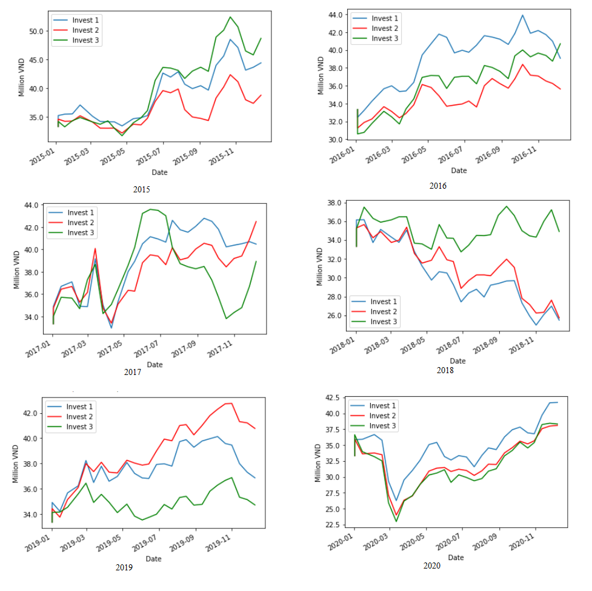
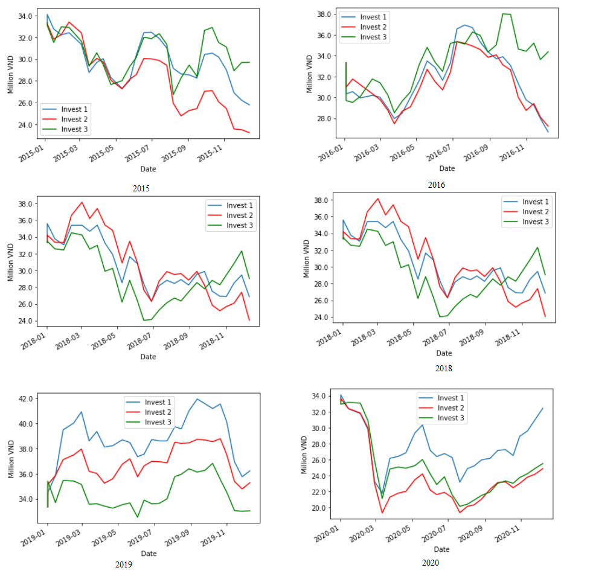
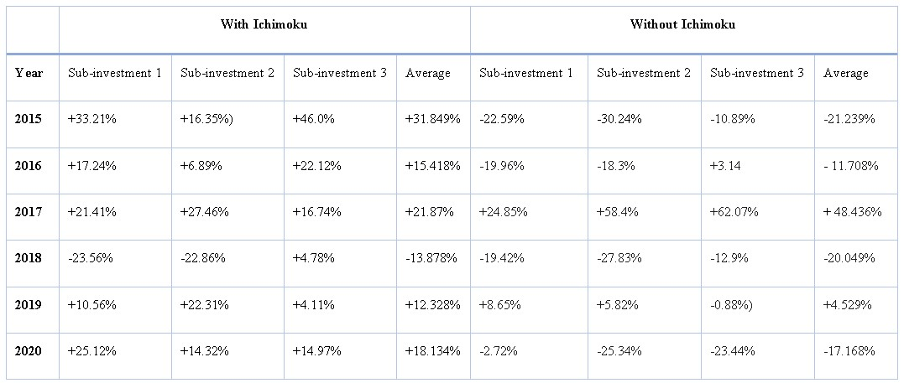
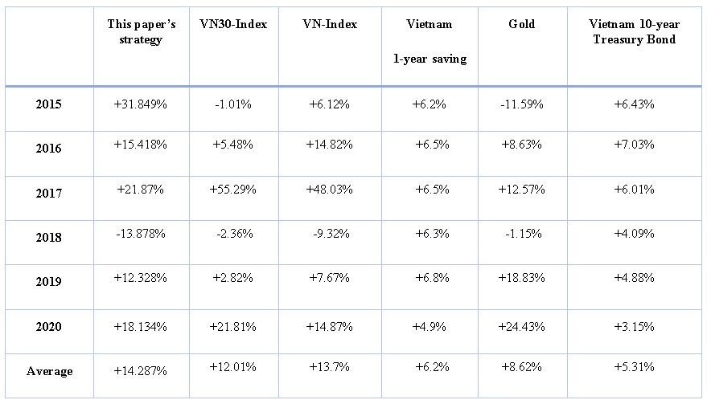

# [An Empirical Examination on forecasting VN30 short-term uptrend stocks using LSTM along with theIchimoku Cloud trading strategy](https://arxiv.org/abs/)

//**https://arxiv.org/abs/2004.10178** <br>
**Hoang Trung Hieu, Pham Ngoc Hai**

we propose a LSTM network that use historical price changes in percentages and features extracted from the Ichimoku Cloud strategy to forecast the probability of outperforming the market of all stocks listed in VN30 index. The study was conducted in a time period of 9 years – from VN30 index’s establishment in 2012 to the end of 2020.

#### Requirements
```
pip install scikit-learn==0.20.4
pip install tensorflow==1.14.0
```

## Plots
We plot the Cumulative money growth during the study periods, with and without Ichimoku Cloud features, to quantify the effectiveness of our model: [10days_trade_pct_ichimoku.ipynb](trainer/10days_trade_pct_ichimoku.ipynb), in the period January 2015 till December 2020. <br>

#### Cumulative Money growth (Proposed model)
<div>

</div>

#### Average daily returns (Without Ichimoku Cloud)
<div>

</div>


## Appendix

#### Financial Performance
<div>

</div>
We compare the financial performance of our proposed model to the performance of the very same model but without the Ichimoku Cloud features. The intent is to highlight the effectiveness of the Ichimoku Cloud in terms of improving prediction power.

<div>

</div>
On the one hand, it can be inferred from the figure that our trading scheme’s performance is very competitive with the performance of the local stock market indexes
  

## References
[1] [Ghosh, P., Neufeld, A. and Sahoo, J., 2021. Forecasting directional movements of stock prices for intraday trading using LSTM and random forests. Finance Research Letters, p. 102280.](https://arxiv.org/abs/2004.10178)
<br>
[2] [Gurrib, I., Kamalov, F. and Elshareif, E., 2020. CAN THE LEADING US ENERGY STOCK PRICES BE PREDICTED USING THE ICHIMOKU CLOUD?. International Journal of Energy Economics and Policy, 11(1), pp. 41-51](https://www.econjournals.com/index.php/ijeep/article/view/10260)


